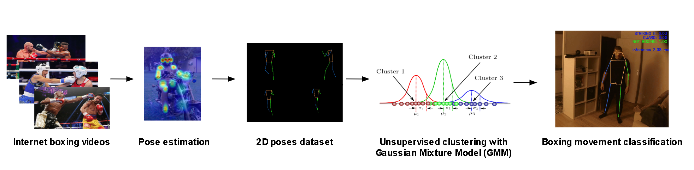

# Shadow-Boxer

## Overview

**Shadow-Boxer** is a research project focused on building a smart shadow-boxing learning module using a single camera. The module has two main components:

1. **Smart Shadow-Boxing Assistant**  
   - Reproduces realistic shadow-boxing strategies given a human pose sequence.  
   - Serves as a real-time instructor for a human learning to shadow box in front of a camera.

2. **Manipulator Robot for Boxing**  
   - Learns boxing movements and strategies to “hit” a learner with realistic strikes.  
   - Maintains **safety** by avoiding collisions with the user.

## Dataset

This repository will soon contain a dataset of **2D poses** estimated from internet videos of experienced boxers performing shadow boxing. The keypoints were estimated using the [RTMO pose estimator](https://github.com/open-mmlab/mmpose/tree/main/projects/rtmo) implemented through fast and easy-to-use [rtmlib](https://github.com/Tau-J/rtmlib). Each sample consists of a series of frames, where each frame has 2D keypoint coordinates representing the pose of a boxer.

## Statistical Modeling: GMMs

We trained, in an unsupervised manner, a **Gaussian Mixture Model (GMM)** using raw internet boxing videos to classify basic boxing actions from sequences of 2D poses. The GMM serves the following purposes:

- **Classify boxing actions**: By analyzing sequences of poses within a sliding window, the model works in real time (~2ms) to provide action labels.  
- **Provide a reward function**: In a reinforcement learning (RL) context, the model’s likelihood is used to reward sequences that resemble real shadow boxing.

## Reinforcement Learning with Genesis

Once the GMM is trained, we use it inside an RL loop to train a **human model** to shadow box properly. This training is conducted in the [Genesis simulator](https://github.com/Genesis-Embodied-AI/Genesis), where:

1. **The policy** (controller) is rewarded based on the likelihood given by the GMM.
2. Over training, the policy learns to produce sequences of poses that maximize the “boxer-like” score.
3. The resulting policy can be deployed in real-time as a **shadow-boxing instructor** or used to train **manipulator robot policies** to box.

## License

This project is licensed under the MIT License.
